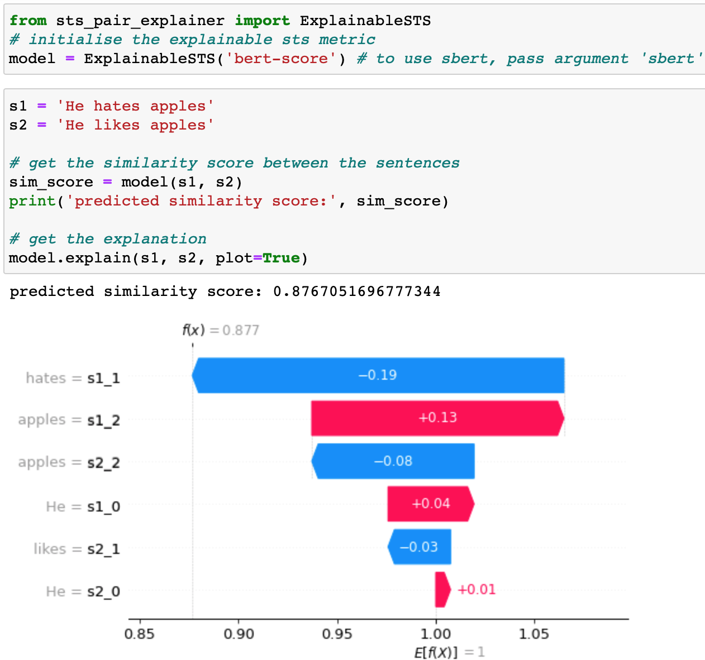

# Explainable STS

This project provides a method that can 
* **measure the semantic similarity** between sentence pairs; and  
* **explain the produced score**, by showing the **contribution** of each word in a sentence.

See [example-link](docs/example.ipynb) for more example use cases.

Contact person: Yang Gao, yang.gao@rhul.ac.uk

https://sites.google.com/site/yanggaoalex/home

Don't hesitate to send us an e-mail or report an issue, if something is broken or if you have further questions

## STS Model
Our semantic similarity measure model was developed based on BERT-large. It was pre-trained with SNLI and MLI, and fine-tuned on the [STSb dataset](https://ixa2.si.ehu.eus/stswiki/index.php/STSbenchmark) and a dataset adapted from [HANS](https://github.com/tommccoy1/hans). Experiments show it performs better than the SOTA STS model, [SBERT](https://github.com/UKPLab/sentence-transformers). The table below compares the scores produced by our system on SBERT on some sample sentence pairs.

## Explanations
We provide explanations by *breaking down* the similarity score to show the *contribution* of each word. The computation was performed by using the [SHAP](https://github.com/slundberg/shap) method.  

## License
Apache License Version 2.0
